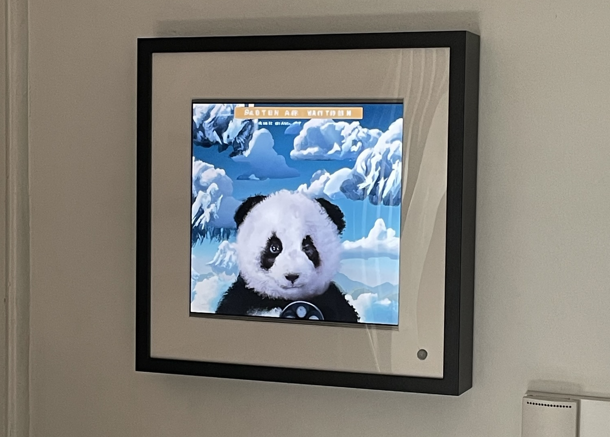

Maker Media GmbH

***

# Staumeldung durch KI-Bilder

## DALL-E visualisiert die von TomTom prognostizierte Fahrzeit

**Natürlich kann man morgens ins Web schauen, um sich ein Bild von der Verkehrslage zu machen. Oder man schaut in diesen KI-Bilderrahmen neben der Tür: Der Raspberry Pi darin holt sich täglich per TomTom-API-Schnittstelle die aktuelle Fahrzeit ins Büro und lässt diese durch DALL-E in ein künstlerisches Bild verwandeln. Delphine und Düsenjäger auf dem Bild stehen für schnelles Durchkommen; erblickt man Buddha oder Schnecken, muss man mehr Zeit einplanen.**

Hier gibt es den **[Code](./scr)** zum Nachbau des Staumelders sowie Testprogramme für die API-Zugriffe sowie ein **[PDF](./doc/Aufbau.pdf)** des Verdrahtungsplans.

Der vollständige Artikel zum Projekt steht in der **[Make-Ausgabe 4/23 ab Seite 76]([https://www.heise.de/select/make/2023/4/2314415312499655078)**.